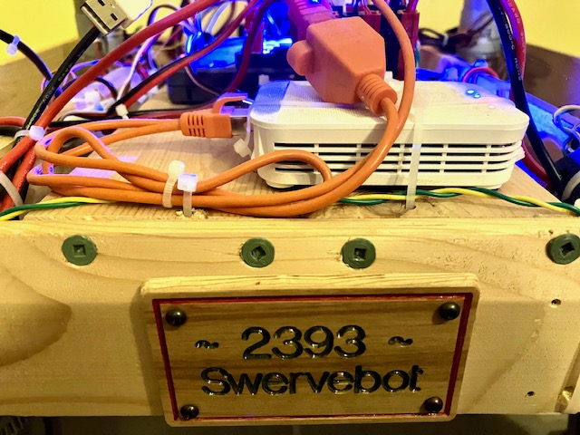

Team 2393 FRC Season 2026
=========================

Software manual: https://docs.wpilib.org/en/latest/

 * The "Introduction" has links to Java learning resources.
   See also [Free Java Book](https://greenteapress.com/wp/think-java-2e/)
 * See "Step 2: Installing Software", "WPILib Installation Guide".
 * See "Basic Programming", "Git Version Control" for installing `git`

Game manual: https://www.firstinspires.org/resource-library/frc/competition-manual-qa-system

Mechanical resources
 * https://www.frcdesign.org/

Get robot code
--------------
 * Start "WPILib VS Code". Invoke "View", "Command Palette...", "Git clone".
   Enter the URL `https://github.com/team2393/FRC2026.git`.
   For a target location, create a folder "git" in your home directory
   and place the git clone there. Select "Open" when then asked to open
   what you just fetched from git.
 * "View", "Command Palette", "WPILib: Simulate Robot Code".
   After a short while, a "Pick extension to run" prompt will appear.
   Select "Sim GUI", press "OK".

Timeline
--------

 * January 10: Kickoff
   - Hardin Valley Academy,11345 Hardin Valley Rd., Knoxville
   - https://www.firstinspires.org/event-detail?eventId=76547

 * Use chassis, roboRIO, power panel, radio from last year's robot
 * Setup roboRIO with current firmware
 * Setup own laptops with current tools
 * Configure radio for 2.4 GHz usage with laptop:
   - Connect via DS port and see http://radio.local or http://192.168.69.1
   - Upgrade firmware https://frc-radio.vivid-hosting.net/overview/upgrading-firmware
   - Configure Robot Radio mode, team number, SSID and 2.4 GHz password, enable 2.4 GHz wifi via DIP #3
   - Check other DIPs to disable power-over-ethernet which could destroy vision processors
 * Tune swerve drivetrain
 * Find camera (limelight 2, maybe later Pi)
 * Jan. 16: Use camera to rotate on target and estimate distance (2D, RotateToTarget).
   Works OK as long as stream resolution is small.
 * Jan. 17: Calibrate camera, use to locate robot on field.
   Mostly works, but X distance off by 10 or 20 cm.
   Mean error 0.27px, FOV 71.2, 56.0, 83.0.
   Calibrated again, and X distance appears good to 1..2 cm!
   Mean error 0.34px, FOV 62.57, 48.92, 74.40.
 * Rotate onto nearest target using that information
 * Find team/drive laptop, set up
 * Gamepiece handling: intake arm, intake mover, storage, spinner?
 * Auto ideas
 * Update from prototype to actual robot
 * Camera positions, considering tag mouning heights in inches
   of hub 44.25, tower 21.75, outpost 21.75, trench 35

 * March 18 - 21: Smoky Mountains Regional
   - Sevierville Convention Center, 202 Gists Creek Rd, Sevierville
   - https://www.firstinspires.org/event-detail?eventId=76272

 * April 8 - 11: Rocket City Regional
   - Von Braun Center, 700 Monroe Street SW, Huntsville, AL USA
   - https://www.firstinspires.org/event-detail?eventId=76307
   - https://frc-events.firstinspires.org/2026/alhu

Camera (Photon Vision, Pi)
--------------------------

See https://docs.photonvision.org/en/latest/docs/quick-start/index.html

 * Get `photonvision-...-linuxarm64_RaspberryPi.img.xz`
   from https://github.com/PhotonVision/photonvision/releases
 * Use etcher or raspberry tool to write memory card
 * Connect Pi to robot network
 * Access from laptop as http://photonvision.local:5800
 * Under "Settings", set Team Number to 2393
 * Change IP Assignment Mode from DHCP to Static,
   set address to `10.23.93.12` and cameran name to `Front`
   respectively   `10.23.93.13` and `Back`.
   (Static `10.TE.AM.6-19` are general purpose.
    `10.TE.AM.11` is also often used for camera, leave that for Limelight)
 * Leave "Hostname" as `photonvision` for Front,
   change to `photonvision2` for Back camera
 * Press SAVE, restart Pi

From now on, access photonvision via http://10.23.93.12:5800 !

 * Setup a camera for first test:
   * "activate" detected USB camera
   * Select "Driver mode"
   * Find settings that "work"  (disable auto-exposure, select )

 * Create "Tag"pipeline for April Tags.
   Should recognize tags in 2D

 * Calibrate camera, test accuracy of detected targets

From https://docs.limelightvision.io/docs/docs-limelight/pipeline-apriltag/apriltags

 * For ideal tracking, consider the following:
    - Your tags should be as flat as possible.
    - Your Limelight should be mounted above or below tag height and angled up/down such that the target is centered.
    - Your target should look as trapezoidal as possible from your camera's perspective.
      You don't want your camera to ever be completely "head-on" with a tag if you want to avoid tag flipping.

 * There is an interplay between the following variables for AprilTag Tracking:
    - Increasing capture resolution will always increase 3D accuracy and increase 3d stability.
      This will also reduce the rate of ambiguity flipping from most perspectives.
      It will usually increase range. This will reduce pipeline framerate.
    - Increasing detector downscale will always increase pipeline framerate.
      It will decrease effective range, but in some cases this may be negligible.
      It will not affect 3D accuracy, 3D stability, or decoding accuracy.
    - Reducing exposure will always improve motion-blur resilience. This is actually really easy to observe. This may reduce range.
    - Reducing the brightness and contrast of the image will generally improve pipeline framerate and reduce range.
    - Increasing Sensor gain allows you to increase brightness without increasing exposure. It may reduce 3D stability, and it may reduce tracking stability.

